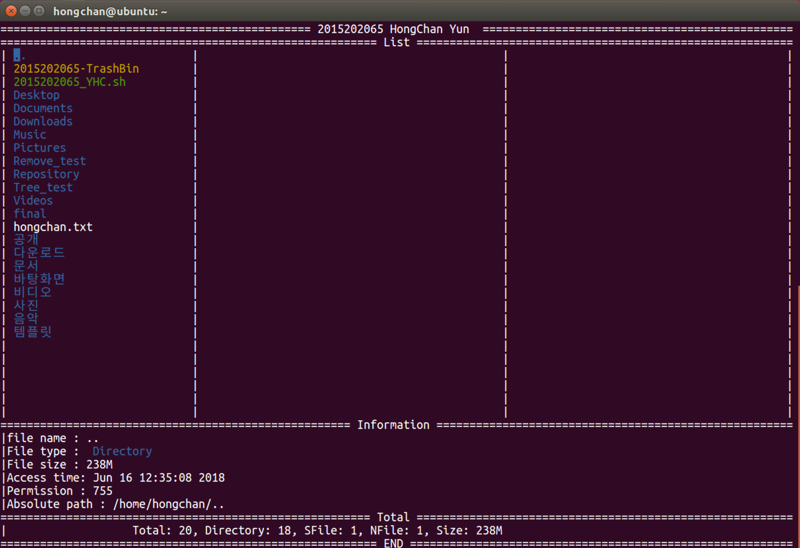

## File Explore (파일 탐색기)

&nbsp;&nbsp;&nbsp;&nbsp;&nbsp;&nbsp;&nbsp;&nbsp;&nbsp;&nbsp;&nbsp;&nbsp;&nbsp;&nbsp;&nbsp;&nbsp;&nbsp;&nbsp;&nbsp;&nbsp;&nbsp;&nbsp;&nbsp;&nbsp;&nbsp;&nbsp;&nbsp;&nbsp;&nbsp;&nbsp;&nbsp;&nbsp;&nbsp;&nbsp;&nbsp;&nbsp;&nbsp;&nbsp;&nbsp;&nbsp;&nbsp;&nbsp;&nbsp;&nbsp;&nbsp;&nbsp;&nbsp;&nbsp;&nbsp;&nbsp;&nbsp;&nbsp;&nbsp;&nbsp;&nbsp;&nbsp;&nbsp;&nbsp;&nbsp;&nbsp;*2018-1 리눅스활용실습 프로젝트*

**쉘 프로그래밍으로 구현한 GUI 파일 탐색기**

 

- **구현한 기능 소개**
  - 현재 경로의 파일 출력
  - 현재 경로의 정보 출력
  - 선택한 파일의 정보 출력
  - 선택한 파일의 내용 출력
  - 선택한 파일 삭제
  - 선택한 폴더의 하위 트리 구조 출력

 

+ **개발 환경**
  + Ubuntu Linux 16.04
  + Vim

 

- **스크린샷**

  </img>
  
  

---

> 2019.7.13 최종 업데이트
>
> 광운대학교 소프트웨어학부 윤홍찬

